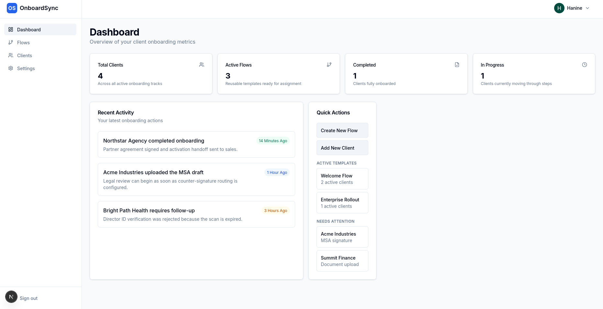
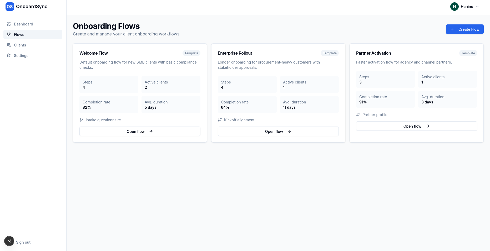
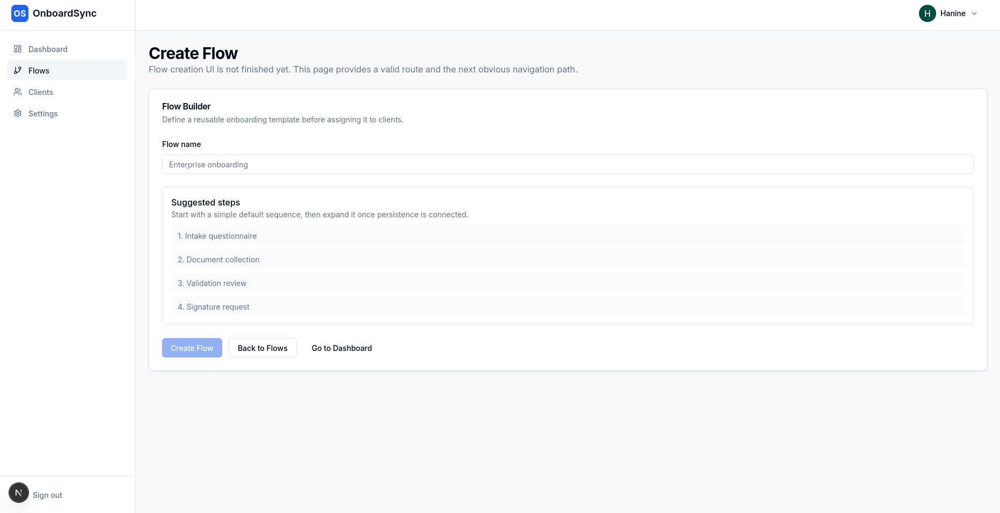
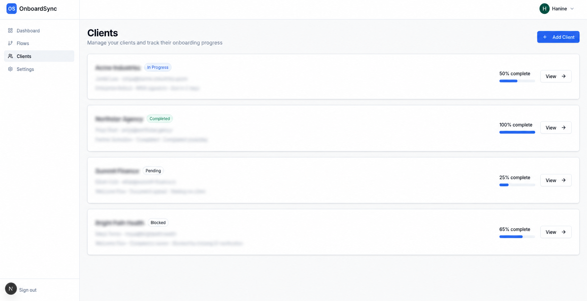
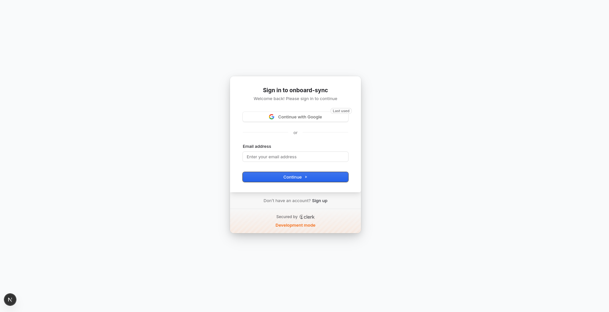

# OnboardSync AI

**Automated client onboarding & document workflow platform** built with Next.js 15, TypeScrip and modern web technologies. OnboardSync AI streamlines the transition from prospect to active client by automating intake, document collection and compliance



##  Key Features

- **Multi-tenant Architecture**: Securely manage multiple organizations, each with their own clients and custom onboarding logic.
- **Dynamic Onboarding Flows**: Create reusable templates for different client tiers (e.g., SMB, Enterprise, Partners).
- **Intelligent Document Management**: Automated collection, processing, and validation of client documents.
- **Integrated E-Signatures**: Seamless integration with **SignWell** for legally binding document execution.
- **Automated Payments**: Handle initial deposits or service fees during onboarding via **Stripe**.
- **AI-Powered Insights**: Leverage AI to automate workflow routing and extract insights from client data.
- **Real-time Monitoring**: A comprehensive dashboard to track completion rates and identify bottlenecks.

---

## Product Tour

### 1. Centralized Dashboard
Monitor your entire onboarding pipeline at a glance. Track active flows, completion rates and recent activities in real-time.


### 2. Flexible Workflow Templates
Define custom onboarding sequences for different business needs. Whether it's a quick "Welcome Flow" or a complex "Enterprise Rollout," OnboardSync handles it all.



### 3. Visual Flow Builder
Easily construct onboarding steps including intake forms, document requests and signature requirements.



### 4. Client Progress Tracking
Keep tabs on every client's journey. Identify blocked steps and send reminders with a single click.



### 5. Secure Authentication
Enterprise-grade security powered by **Clerk**, supporting social logins and multi-factor authentication.



---

## Tech Stack

| Layer | Technology |
| :--- | :--- |
| **Frontend** | Next.js 15 (App Router), React 19, Tailwind CSS |
| **Backend** | Next.js Server Actions, Inngest (Workflows) |
| **Database** | PostgreSQL with Drizzle ORM |
| **Auth** | Clerk |
| **Payments** | Stripe |
| **Signatures** | SignWell |
| **Storage** | AWS S3 / Cloudflare R2 |
| **Monitoring** | Sentry & PostHog |

---

## Getting Started

### Prerequisites

- Node.js 18+
- PostgreSQL database (Neon/Supabase recommended)
- Accounts for: Clerk, Stripe, SignWell, AWS/Cloudflare, Resend

### Installation

1. **Clone the repository:**
   ```bash
   git clone https://github.com/ayarihanine/onboard-sync.git
   cd onboard-sync
   ```

2. **Install dependencies:**
   ```bash
   npm install
   ```

3. **Configure Environment:**
   Copy `.env.example` to `.env.local` and fill in your API keys.
   ```bash
   cp .env.example .env.local
   ```

4. **Initialize Database:**
   ```bash
   npm run db:push
   ```

5. **Start Development:**
   ```bash
   npm run dev
   ```

---

## Database Schema

The system uses a relational schema optimized for multi-tenancy:
- **Organizations**: The root entity for all data.
- **Onboarding Flows**: Reusable step-by-step templates.
- **Clients**: Individual entities assigned to specific flows.
- **Documents & Signatures**: Tracking for all compliance artifacts.

---

## License
 See `package.json` for more details.
